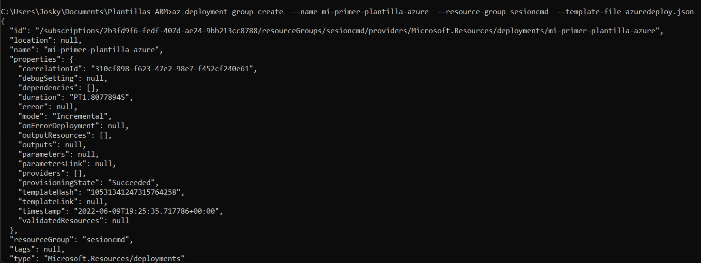

# En este apartado veremos como utilzar las plantillas ARM

- Primero debemos crear un recurso en [Portal Azure](https://portal.azure.com/#home) 
Una vez dentro del recurso nos iremos al apartado de exportar plantilla

#### Crearemos nuestra propia plantilla de ARM
-Primero crearemos un archivo con la terminacion ".json" y escribiremos lo siguiente:
{
    "$schema":  "https://schema.management.azure.com/schemas/2019-04-01/deploymentTemplate.json#",
    "contentVersion": "1.0.1.0",
    "resources" : []
}

Se nos descargara un archivo, despues de eso abriremos un cmd dentro de la carpeta donde hayamos creado el archivo con terminacion ".json" y ejecuraremos el siguiente codigo

az deployment group create  --name "nombre que sea"  --resource-group "nombre del grupo de recursos"  --template-file "Nombre del archivo que creamos con la terminacion .json"

Para asegurarnos que creamos de manera correcta la plantilla nos iremos a nuestro en Azure y en el apartado de "Implementaciones" debera aparecer la plantilla que acabos de crear

##### No tendra nada el recurso, para implementar algo dentro de nuestra plantilla escribiremos lo siguiente:

{
    "$schema":  "https://schema.management.azure.com/schemas/2019-04-01/deploymentTemplate.json#",
    "contentVersion": "1.0.1.0",
    "resources" : [
        {
            "type": "Tipo de recurso que queremos crear",
            "apiVersion": "Version de la misma",
            "name": "nombre del recurso",
            "location": "localizacion del recurso",
            "sku": {
                "name": "paquete de recurso"
            },
            "kind": "tipo de recurso",
            "properties": {
                "la propiedad del recurso": true
            }
        }
    ]
}

Despues de esto abriremos CMD en la carpeta donde se encuentra nuestro archivo con terminacion ".json" y ejecutaremos denuevo el codigo

az deployment group create  --name "nombre que sea"  --resource-group "nombre del grupo de recursos"  --template-file "Nombre del archivo que creamos con la terminacion .json"

Una vez cargado, podremos visualizar dentro de nuestros recursos que se ha creado nuestra plantilla de una cuenta de almacenamiento

######Listo ya hemos creado nuestra plantilla ARM
